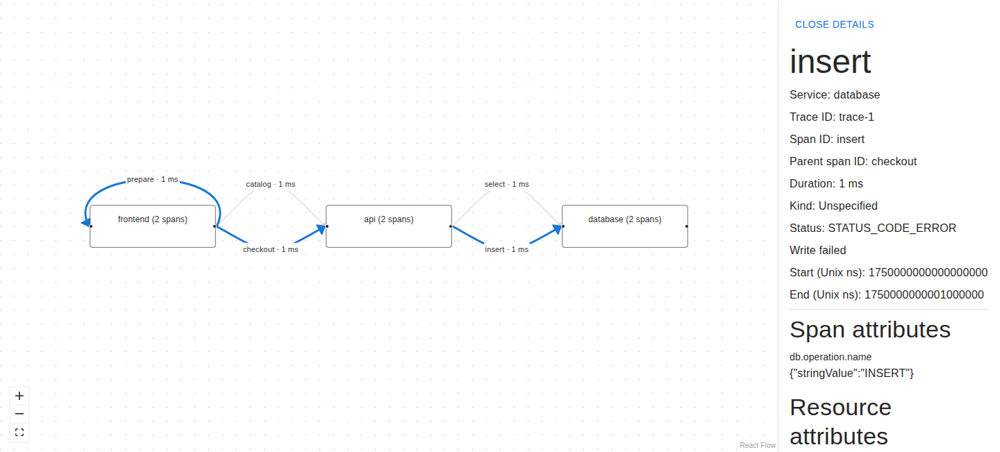

# Trace Graph

The Trace Graph panel visualizes one distributed trace as service nodes and directed span arrows with React Flow.
Selecting a node opens its service details on the right. Selecting an arrow shows span details and highlights the
parent spans leading to that connection, including calls within a service.

See the [plugin documentation](../../tracegraph/README.md) for interaction behavior, configuration, development, and the
Dashboard-as-Code Go SDK.
